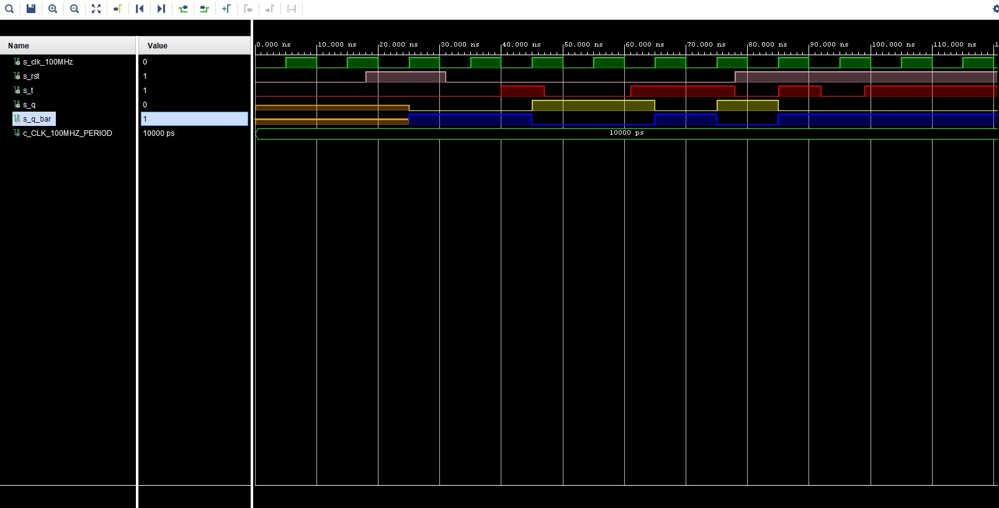

# Lab.07

## Pospíšil Martin 221454

**Characteristic equations and completed tables for D, JK, T flip-flops:**


| clk                | d    | q(n) | q(n+1) | comments                                                     |
| ------------------ | ---- | ---- | ------ | ------------------------------------------------------------ |
|  | 0    | 0    | 0      | Input signal is sampled at the rising edge of clock and stored to FF |
|  | 0    | 1    | 0      | Input signal is sampled at the rising edge of clock and stored to FF |
|  | 1    | 0    | 1      | Input signal is sampled at the rising edge of clock and stored to FF |
|  | 1    | 1    | 1      | Input signal is sampled at the rising edge of clock and stored to FF |


| clk                | J    | K    | Qn   | Q(n+1) | comments  |
| ------------------ | ---- | ---- | ---- | ------ | --------- |
|  | 0    | 0    | 0    | 0      | no change |
|  | 0    | 0    | 1    | 1      | no change |
|  | 0    | 1    | 0    | 0      | reset     |
|  | 0    | 1    | 1    | 0      | reset     |
|  | 1    | 0    | 0    | 1      | set       |
|  | 1    | 0    | 1    | 1      | set       |
|  | 1    | 1    | 0    | 1      | toggle    |
|  | 1    | 1    | 1    | 0      | toggle    |

**VHDL code listing of the process `p_d_latch` with syntax highlighting:**

```vhdl
p_d_latch : process (d, arst, en)
begin
    if (arst = '1') then
        q <= '0';
        q_bar <= '1';            
   elsif
      (en = '1') then
        q <= d;
        q_bar <= not d;
    end if;
end process p_d_latch;
```


**Listing of VHDL reset and stimulus processes from the testbench `tb_d_latch.vhd` file with syntax highlighting and asserts:**

```vhdl
 p_reset_gen : process
     begin
         s_arst <= '0';
         wait for 38 ns;         
         -- Reset activated
         s_arst <= '1';
         wait for 53 ns;
         -- deactivated
         s_arst <= '0';        
         wait for 80 ns;
         s_arst <= '1';
         wait;
     end process p_reset_gen;

    --------------------------------------------------------------------
    -- Data gen. process
    --------------------------------------------------------------------
    p_stimulus : process
    begin
        report "Stimulus process started" severity note;
        
        s_d  <= '0';
        s_en <= '0';
        
        --d sekv
        wait for 10 ns;
        s_d  <= '1';
        wait for 10 ns;
        s_d  <= '0';
        wait for 10 ns;
        s_d  <= '1';
        wait for 10 ns;
        s_d  <= '0';
        wait for 5 ns;
        
        assert ((s_arst = '1') and (s_en = '0') and (s_q = '0') and (s_q_bar = '1'))
        report "Test failed for reset high, en low when s_d = '0'" severity error;
        
        wait for 5 ns;
        s_d  <= '1';
        wait for 5 ns;
        
        assert ((s_arst = '1') and (s_en = '0') and (s_q = '0') and (s_q_bar = '1'))
        report "Test failed for reset high, en low when s_d = '1'" severity error;
        
        wait for 5 ns;
        s_d  <= '0';
        --/d sekv
        
        s_en <= '1';
        
        --d sekv
        wait for 10 ns;
        s_d  <= '1';
        wait for 5 ns;
        
        assert ((s_arst = '1') and (s_en = '1') and (s_q = '0') and (s_q_bar = '1'))
        report "Test failed for reset high, en high when s_d = '1'" severity error;
        
        wait for 5 ns;
        s_d  <= '0';
        wait for 5 ns;
        
        assert ((s_arst = '1') and (s_en = '1') and (s_q = '0') and (s_q_bar = '1'))
        report "Test failed for reset high, en high when s_d = '0'" severity error;          
        
        wait for 5 ns;
        s_d  <= '1';
        wait for 10 ns;
        s_d  <= '0';
        wait for 10 ns;
        s_d  <= '1';
        wait for 5 ns;
        
        assert ((s_arst = '0') and (s_en = '1') and (s_q = '1') and (s_q_bar = '0'))
        report "Test failed for reset low, en high when s_d = '1'" severity error;
        
        wait for 15 ns;
        s_d  <= '0';
        wait for 5 ns;
        
        assert ((s_arst = '0') and (s_en = '1') and (s_q = '0') and (s_q_bar = '1'))
        report "Test failed for reset low, en high when s_d = '0'" severity error;
        
        --/d sekv
        
        --d sekv
        wait for 5 ns;
        s_d  <= '1';
        wait for 5 ns;
        s_en <= '0';
        wait for 5 ns;
        s_d  <= '0';
   
        wait for 10 ns;
        s_d  <= '1';
        wait for 10 ns;
        s_d  <= '0';
        wait for 10 ns;
        s_d  <= '1';
        wait for 10 ns;
        s_d  <= '0';
        --/d sekv
                  
        report "Stimulus process finished" severity note;
        wait;
    end process p_stimulus;
```

**Screenshot with simulated time waveforms:**


**VHDL code listing of the processes `p_d_ff_arst`, `p_d_ff_rst`, `p_jk_ff_rst`, `p_t_ff_rst` with syntax highlighting:**

**p_d_ff_arst**

```vhdl
p_d_ff_arst : process (clk, arst)
begin
    if (arst = '1') then
        q <= '0';
        q_bar <= '1';            
   elsif
      rising_edge(clk) then
        q <= d;
        q_bar <= not d;
    end if;
end process p_d_ff_arst;
```

**p_d_ff_rst**

```vhdl
d_ff_rst : process (clk)
begin
  if rising_edge(clk) then
            if (rst = '1') then
                q <= '0';
                q_bar <= '1';
            else
                q <= d;
                q_bar <= not d;
            end if;
        end if;
end process d_ff_rst;
```

**p_jk_ff_rst**

```vhdl
p_jk_ff_rst : process (clk)
begin
   if rising_edge(clk) then
     if (rst ='1') then
         s_q <= '0';
     else
        if (j = '0' and k= '0') then
            s_q <= s_q;
        elsif (j = '0' and k = '1') then
            s_q <= '0';
        elsif (j = '1' and k = '0') then
            s_q <= '1';
        elsif (j = '1' and k = '1') then
            s_q <= not s_q;      
        end if;    
     end if; 
   end if;
end process p_jk_ff_rst;
```

**p_t_ff_rst**

```vhdl
p_t_ff_rst : process (clk)
begin
    if rising_edge(clk) then
        if (rst = '1') then
            s_q <= '0';
        elsif (t = '1') then
            s_q <= not s_q;
        end if;
    end if;
end process p_t_ff_rst;
```

**Listing of VHDL clock, reset and stimulus processes from the testbench files with syntax highlighting and asserts:**

**tb_d_ff_arst**

```vhdl
p_reset_gen : process
        begin
            s_arst <= '0';
            wait for 28 ns;
            
            -- Reset activated
            s_arst <= '1';
            wait for 13 ns;
    
            -- deactivated
            s_arst <= '0';
            
            wait for 17 ns;
            
            s_arst <= '1';
            wait for 33 ns;
            
            wait for 660 ns;
            s_arst <= '1';
    
            wait;
     end process p_reset_gen;

    --------------------------------------------------------------------
    -- Data gen. process
    --------------------------------------------------------------------
    p_stimulus : process
    begin
        report "Stimulus process started" severity note;
        
        s_d  <= '0';
        
        --d sekv
        wait for 14 ns;
        s_d  <= '1';
        wait for 2 ns;
        
        assert ((s_arst = '0') and (s_q = '1') and (s_q_bar = '0'))
        report "Test failed for reset low, after clk rising when s_d = '1'" severity error;
        
        wait for 8 ns;
        s_d  <= '0';
        wait for 6 ns;
        
        --assert()
        --report "";
        
        wait for 4 ns;
        s_d  <= '1';
        wait for 10 ns;
        s_d  <= '0';
        wait for 10 ns;
        s_d  <= '1';
        wait for 5 ns;
        
       
        assert ((s_arst = '1') and (s_q = '0') and (s_q_bar = '1'))
        report "Test failed for reset high, before clk rising when s_d = '1'" severity error;
        
        wait for 5 ns;
        s_d  <= '0';
        --/d sekv
        
        --d sekv
        wait for 14 ns;
        s_d  <= '1';
        wait for 10 ns;
        s_d  <= '0';
        wait for 10 ns;
        s_d  <= '1';
        wait for 10 ns;
        s_d  <= '0';
        wait for 10 ns;
        s_d  <= '1';
        wait for 10 ns;
        s_d  <= '0';
        --/d sekv
        
       
        report "Stimulus process finished" severity note;
        wait;
    end process p_stimulus;
```

**tb_d_ff_rst**

```vhdl
p_reset_gen : process
        begin
            s_rst <= '0';
            wait for 28 ns;
            
            -- Reset activated
            s_rst <= '1';
            wait for 13 ns;
    
            -- deactivated
            s_rst <= '0';
            
            wait for 17 ns;
            
            s_rst <= '1';
            wait for 33 ns;
            
            wait for 660 ns;
            s_rst <= '1';
    
            wait;
     end process p_reset_gen;

    --------------------------------------------------------------------
    -- Data gen. process
    --------------------------------------------------------------------
    p_stimulus : process
    begin
        report "Stimulus process started" severity note;
        
        s_d  <= '0';
        
        --d sekv
        wait for 14 ns;
        s_d  <= '1';
        wait for 2 ns;
        
        assert ((s_rst = '0') and (s_q = '1') and (s_q_bar = '0'))
        report "Test failed for reset low, after clk rising when s_d = '1'" severity error;
        
        wait for 8 ns;
        s_d  <= '0';
        wait for 6 ns;
        
        --assert()
        --report "";
        
        wait for 4 ns;
        s_d  <= '1';
        wait for 10 ns;
        s_d  <= '0';
        wait for 10 ns;
        s_d  <= '1';
        wait for 5 ns;
        
        -- verify that reset is truly synchronous
        assert ((s_rst = '1') and (s_q = '1') and (s_q_bar = '0'))
        report "Test failed for reset high, before clk rising when s_d = '1'" severity error;
        
        wait for 5 ns;
        s_d  <= '0';
        --/d sekv
        
        --d sekv
        wait for 14 ns;
        s_d  <= '1';
        wait for 10 ns;
        s_d  <= '0';
        wait for 10 ns;
        s_d  <= '1';
        wait for 10 ns;
        s_d  <= '0';
        wait for 10 ns;
        s_d  <= '1';
        wait for 10 ns;
        s_d  <= '0';
        --/d sekv
        
       
        report "Stimulus process finished" severity note;
        wait;
    end process p_stimulus;
```

**tb_jk_ff_rst**

```vhdl
p_reset_gen : process
        begin
            s_rst <= '0';
            wait for 28 ns;
            
            -- Reset activated
            s_rst <= '1';
            wait for 13 ns;
    
            -- deactivated
            s_rst <= '0';
            
            wait for 47 ns;
            
            s_rst <= '1';
            wait for 33 ns;
            
            wait for 660 ns;
            s_rst <= '1';
    
            wait;
     end process p_reset_gen;

    --------------------------------------------------------------------
    -- Data gen. process
    --------------------------------------------------------------------
    p_stimulus : process
    begin
        report "Stimulus process started" severity note;
        s_j  <= '0';
        s_k  <= '0';
        
        --d sekv
        wait for 37 ns;
        assert ((s_rst = '0') and (s_j = '0') and (s_k = '0') and (s_q = '0') and (s_q_bar = '1'))
	    report "Test 'no change' failed for reset low, after clk rising when s_j = '0' and s_k = '0'" severity error;
	    
	    wait for 2 ns;
	    s_j  <= '1';
	    s_k  <= '0';
	    wait for 6 ns;
	    
	    assert ((s_rst = '0') and (s_j = '1') and (s_k = '0') and (s_q = '1') and (s_q_bar = '0'))
	    report "Test 'set' failed for reset low, after clk rising when s_j = '1' and s_k = '0'" severity error;
	    
	    wait for 1 ns;
	    s_j  <= '0';
	    s_k  <= '1';
	    wait for 13 ns;
	    
	    assert ((s_rst = '0') and (s_j = '0') and (s_k = '1') and (s_q = '0') and (s_q_bar = '1'))
	    report "Test 'reset' failed for reset low, after clk rising when s_j = '0' and s_k = '1'" severity error;
	    
	    wait for 1 ns;
	    s_j  <= '1';
	    s_k  <= '0';
	    wait for 7 ns;
	    s_j  <= '1';
	    s_k  <= '1';
	    
	    wait for 8 ns;
	    
	    assert ((s_rst = '0') and (s_j = '1') and (s_k = '1') and (s_q = '0') and (s_q_bar = '1'))
	    report "Test 'toggle' failed for reset low, after clk rising when s_j = '1' and s_k = '1'" severity error;
	    
	    wait for 2 ns;
	    s_j  <= '0';
	    s_k  <= '0';
	    wait for 7 ns;
	    s_j  <= '0';
	    s_k  <= '1';
	    wait for 7 ns;
	    s_j  <= '1';
	    s_k  <= '0';
	    wait for 7 ns;
	    s_j  <= '1';
	    s_k  <= '1';
           
        report "Stimulus process finished" severity note;
        wait;
    end process p_stimulus;
```

**tb_t_ff_rst**

```vhdl
p_reset_gen : process
        begin
            s_rst <= '0';
            wait for 18 ns;
            
            -- Reset activated
            s_rst <= '1';
            wait for 13 ns;
    
            -- deactivated
            s_rst <= '0';
            
            wait for 47 ns;
            
            s_rst <= '1';
            wait for 33 ns;
            
            wait for 660 ns;
            s_rst <= '1';
    
            wait;
     end process p_reset_gen;

    --------------------------------------------------------------------
    -- Data gen. process
    --------------------------------------------------------------------
    p_stimulus : process
    begin
        report "Stimulus process started" severity note;
        
        s_t  <= '0';
        
        --d sekv
        wait for 38 ns;
        
        assert ((s_rst = '0') and (s_t = '0') and (s_q = '0') and (s_q_bar = '1'))
        report "Test 'no change' failed for reset low, after clk rising when s_t = '0'" severity error;
        
        wait for 2 ns;
        s_t  <= '1';
        wait for 6 ns;
        
        assert ((s_rst = '0') and (s_t = '1') and (s_q = '1') and (s_q_bar = '0'))
        report "Test 'toggle' failed for reset low, after clk rising when s_t = '1'" severity error;
        
        wait for 1 ns;
        s_t  <= '0';
        wait for 13 ns;
        
        assert ((s_rst = '0') and (s_t = '0') and (s_q = '1') and (s_q_bar = '0'))
        report "Test 'no change' failed for reset low, after clk rising when s_t = '0'" severity error;
        
        wait for 1 ns;
        s_t  <= '1';
        wait for 5 ns;
        
        assert ((s_rst = '0') and (s_t = '1') and (s_q = '0') and (s_q_bar = '1'))
        report "Test 'toggle' failed for reset low, after clk rising when s_t = '1'" severity error;
        
        wait for 12 ns;
        s_t  <= '0';
        wait for 7 ns;
        s_t  <= '1';
        wait for 7 ns;
        s_t  <= '0';
        wait for 7 ns;
        s_t  <= '1';
        
        --assert()
        --report "       
        report "Stimulus process finished" severity note;
        wait;
    end process p_stimulus;
```

**Screenshot with simulated time waveforms; always display all inputs and outputs. The full functionality of the entities must be verified:**

**p_d_ff_arst**


**p_d_ff_rst**


**p_jk_ff_rst**


**p_t_ff_rst**



**Image of the shift register schematic. The image can be drawn on a computer or by hand. Name all inputs, outputs, components and internal signals:**


