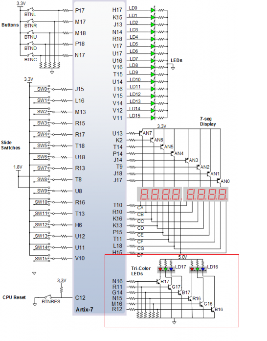
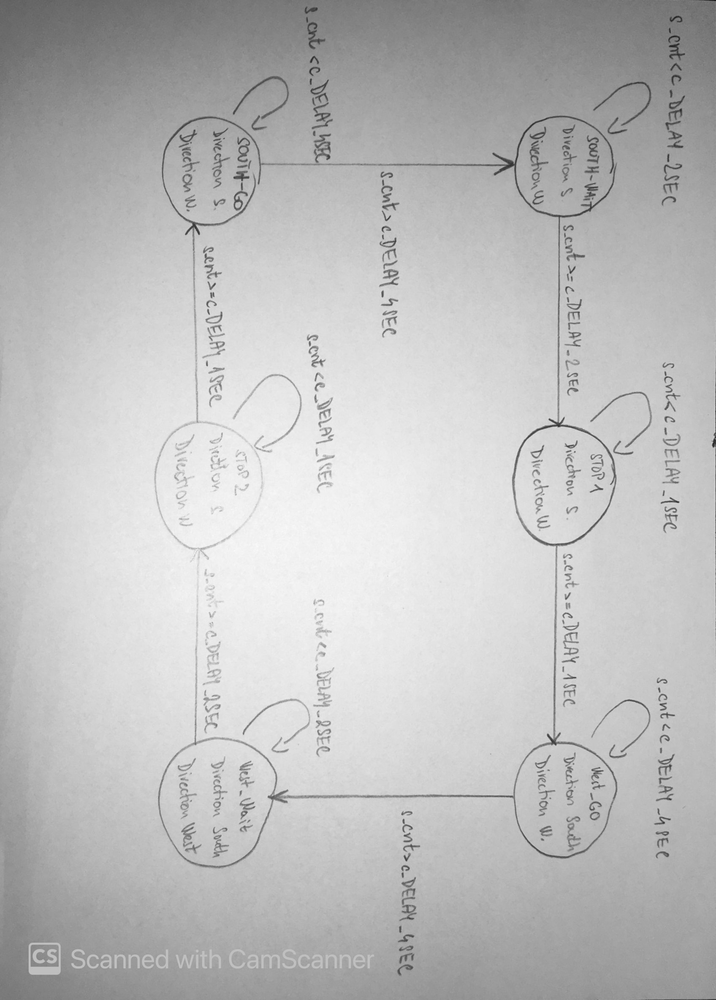
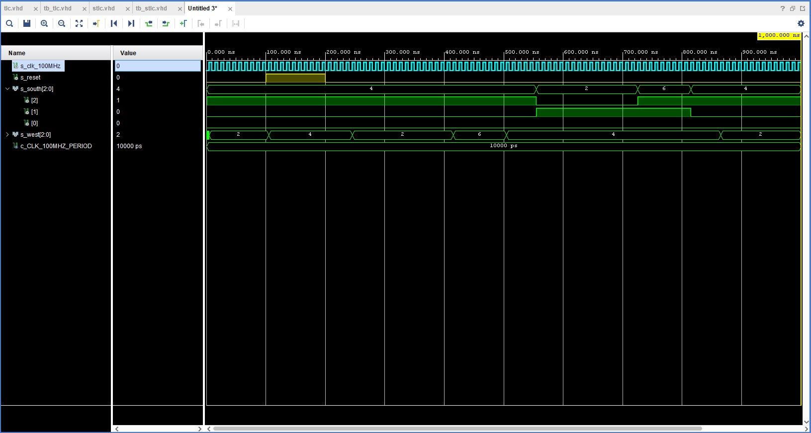
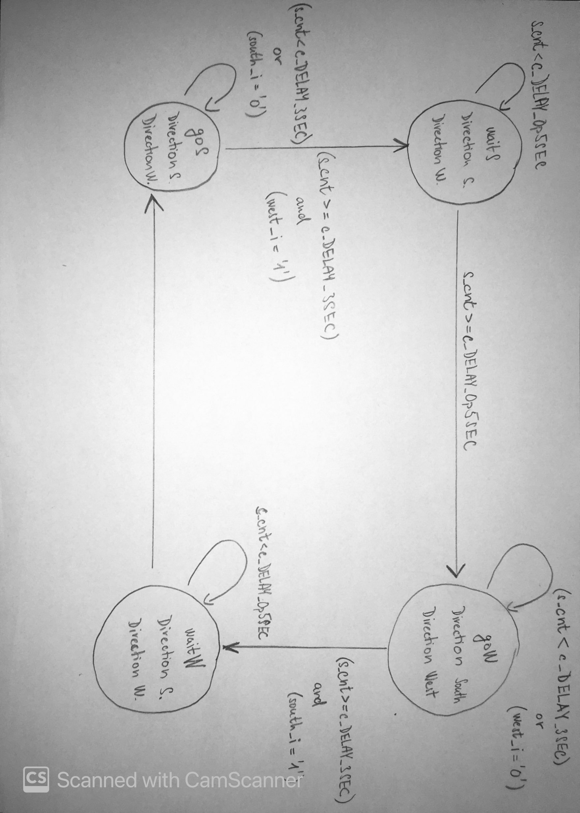

# Lab.08

## Pospíšil Martin 221454


#### Completed state table

| **Input P**  |            `0`             |            `0`             |            `1`             |            `1`             |            `0`             |            `1`             |            `0`             |            `1`             |            `1`             |            `1`             |            `1`             |            `0`             |            `0`             |            `1`             |            `1`             |            `1`             |
| :----------- | :------------------------: | :------------------------: | :------------------------: | :------------------------: | :------------------------: | :------------------------: | :------------------------: | :------------------------: | :------------------------: | :------------------------: | :------------------------: | :------------------------: | :------------------------: | :------------------------: | :------------------------: | :------------------------: |
| **Clock**    |  |  |  |  |  |  |  |  |  |  |  |  |  |  |  |  |
| **State**    |             A              |             A              |             D              |             C              |             C              |             D              |             A              |             B              |             C              |             D              |             B              |             B              |             B              |             C              |             D              |             B              |
| **Output R** |            `0`             |             0              |             0              |             0              |             0              |             1              |             0              |             0              |             0              |             1              |             0              |             0              |             0              |             0              |             1              |             0              |


#### Figure with connection of RGB LEDs on Nexys A7 board and completed table with color settings



| *RGB LED** | **Artix-7 pin names** | **Red** | **Yellow** | **Green** |
| :--------: | :-------------------: | :-----: | :--------: | :-------: |
|    LD16    |     N15, M16, R12     | `1,0,0` |  `1,1,0`   |  `0,1,0`  |
|    LD17    |     N16, R11, G14     | `1,0,0` |  `1,1,0`   |  `0,1,0`  |

#### Traffic light controller

**State diagram:**



**Listing of VHDL code of sequential process  ``` p_traffic_fsm ```**:

```vhdl
p_traffic_fsm : process(clk)
    begin
        if rising_edge(clk) then
            if (reset = '1') then       -- Synchronous reset
                s_state <= STOP1 ;      -- Set initial state
                s_cnt   <= c_ZERO;      -- Clear all bits

            elsif (s_en = '1') then
                -- Every 250 ms, CASE checks the value of the s_state 
                -- variable and changes to the next state according 
                -- to the delay value.
                case s_state is

                    -- If the current state is STOP1, then wait 1 sec
                    -- and move to the next GO_WAIT state.
                    when STOP1 =>
                        -- Count up to c_DELAY_1SEC
                        if (s_cnt < c_DELAY_1SEC) then
                            s_cnt <= s_cnt + 1;
                        else
                            -- Move to the next state
                            s_state <= WEST_GO;
                            -- Reset local counter value
                            s_cnt   <= c_ZERO;
                        end if;

                    when WEST_GO =>
                        -- Count up to c_DELAY_1SEC
                        if (s_cnt < c_DELAY_4SEC) then
                            s_cnt <= s_cnt + 1;
                        else
                            -- Move to the next state
                            s_state <= WEST_WAIT;
                            -- Reset local counter value
                            s_cnt   <= c_ZERO;
                        end if;
                        
                    when WEST_WAIT =>
                        -- Count up to c_DELAY_1SEC
                        if (s_cnt < c_DELAY_2SEC) then
                            s_cnt <= s_cnt + 1;
                        else
                            -- Move to the next state
                            s_state <= STOP2;
                            -- Reset local counter value
                            s_cnt   <= c_ZERO;
                        end if;
                    when STOP2 =>
                        -- Count up to c_DELAY_1SEC
                        if (s_cnt < c_DELAY_1SEC) then
                            s_cnt <= s_cnt + 1;
                        else
                            -- Move to the next state
                            s_state <= SOUTH_GO;
                            -- Reset local counter value
                            s_cnt   <= c_ZERO;
                        end if;

                    when SOUTH_GO =>
                        -- Count up to c_DELAY_1SEC
                        if (s_cnt < c_DELAY_4SEC) then
                            s_cnt <= s_cnt + 1;
                        else
                            -- Move to the next state
                            s_state <= SOUTH_WAIT;
                            -- Reset local counter value
                            s_cnt   <= c_ZERO;
                        end if;
                        
                    when SOUTH_WAIT =>
                        -- Count up to c_DELAY_1SEC
                        if (s_cnt < c_DELAY_2SEC) then
                            s_cnt <= s_cnt + 1;
                        else
                            -- Move to the next state
                            s_state <= STOP1;
                            -- Reset local counter value
                            s_cnt   <= c_ZERO;
                        end if;

                    -- It is a good programming practice to use the 
                    -- OTHERS clause, even if all CASE choices have 
                    -- been made. 
                    when others =>
                        s_state <= STOP1;

                end case;
            end if; -- Synchronous reset
        end if; -- Rising edge
    end process p_traffic_fsm;
```

**Listing of VHDL code of combinatorial process  ``` p_output_fsm ```:**

```vhdl
p_output_fsm : process(s_state)
    begin
        case s_state is
            when STOP1 =>
                south_o <= "100";   -- Red (RGB = 100)
                west_o  <= "100";   -- Red (RGB = 100)                
            when WEST_GO =>
                south_o <= "100";   -- Red (RGB = 100)
                west_o  <= "010";   -- GREEN (RGB = 010)               
            when WEST_WAIT =>
                south_o <= "100";   -- Red (RGB = 100)
                west_o  <= "110";   -- YELLOW (RGB = 110)                
            when STOP2 =>
                south_o <= "100";   -- Red (RGB = 100)
                west_o  <= "100";   -- Red (RGB = 100)                
            when SOUTH_GO =>
                south_o <= "010";   -- GREEN (RGB = 010)
                west_o  <= "100";   -- Red (RGB = 100)                
            when SOUTH_WAIT =>
                south_o <= "110";   -- YELLOW (RGB = 110)
                west_o  <= "100";   -- Red (RGB = 100)
            when others =>
                south_o <= "100";   -- Red
                west_o  <= "100";   -- Red
        end case;
    end process p_output_fsm;

end architecture Behavioral;
```

**Screenshots of the simulation**




### State table

| **Current state** | **Direction South** | **Direction West** |   **Delay**    | **No cars** | **Cars West** | **Cars South** | **Cars both directions** |
| :---------------- | :-----------------: | :----------------: | :------------: | :---------: | :-----------: | :------------: | :----------------------: |
| `goS`             |        green        |        red         | at least 3 sec |    `goS`    |    `waitS`    |     `goS`      |         `waitS`          |
| `waitS`           |       yellow        |        red         |    0.5 sec     |    `goW`    |     `goW`     |     `goW`      |          `goW`           |
| `goW`             |         red         |       green        | at least 3 sec |    `goW`    |     `goW`     |    `waitW`     |         `waitW`          |
| `waitW`           |         red         |       yellow       |    0.5 sec     |    `goS`    |     `goS`     |     `goS`      |          `goS`           |


**State diagram**



**Listing of VHDL code of sequential process ``` p_smart_traffic_fsm ```**

```vhdl
p_smart_traffic_fsm : process(clk)
    begin
        if rising_edge(clk) then
            if (reset = '1') then       -- Synchronous reset
                s_state <= goS ;        -- Set initial state
                s_cnt   <= c_ZERO;      -- Clear all bits

            elsif (s_en = '1') then
                -- Every 250 ms, CASE checks the value of the s_state 
                -- variable and changes to the next state according 
                -- to the delay value.
                case s_state is

                    when goS =>
                        if (s_cnt < c_DELAY_3SEC) then
                            s_cnt <= s_cnt + 1;
                        elsif (west_i = '1') then
                            -- Move to the next state
                            s_state <= waitS;
                            -- Reset local counter value
                            s_cnt   <= c_ZERO;
                        end if;

                    when waitS =>
                        -- WRITE YOUR CODE HERE
                        if (s_cnt < c_DELAY_0p5SEC) then
                            s_cnt <= s_cnt + 1;
                        else
                            -- Move to the next state
                            s_state <= goW;
                            -- Reset local counter value
                            s_cnt   <= c_ZERO;
                        end if;
                    
                    when goW =>
                        if (s_cnt < c_DELAY_3SEC) then
                            s_cnt <= s_cnt + 1;
                        elsif (south_i = '1') then
                            -- Move to the next state
                            s_state <= waitW;
                            -- Reset local counter value
                            s_cnt   <= c_ZERO;
                        end if;
                        
                    when waitW =>
                        -- WRITE YOUR CODE HERE
                        if (s_cnt < c_DELAY_0p5SEC) then
                            s_cnt <= s_cnt + 1;
                        else
                            -- Move to the next state
                            s_state <= goS;
                            -- Reset local counter value
                            s_cnt   <= c_ZERO;
                        end if;
                        
                    -- It is a good programming practice to use the 
                    -- OTHERS clause, even if all CASE choices have 
                    -- been made. 
                    when others =>
                        s_state <= goS;

                end case;
            end if; -- Synchronous reset
        end if; -- Rising edge
    end process p_smart_traffic_fsm;
```

