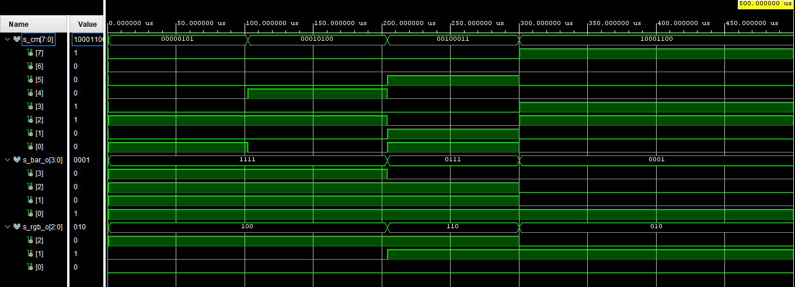
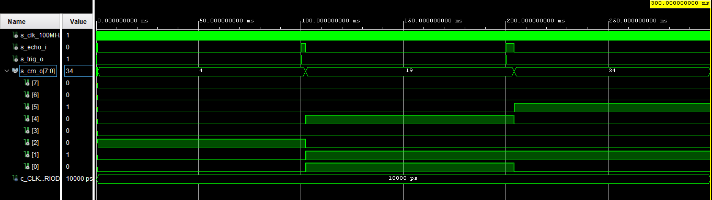
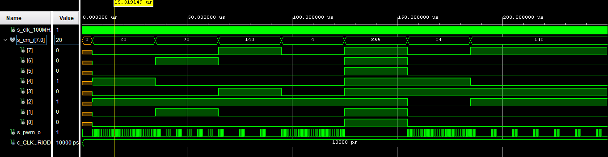
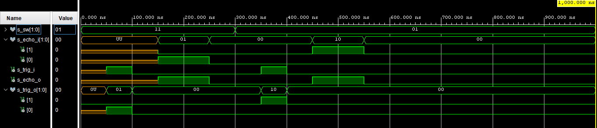
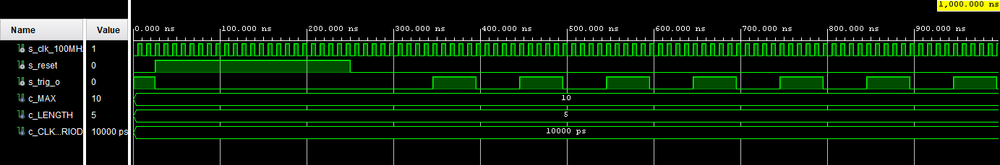
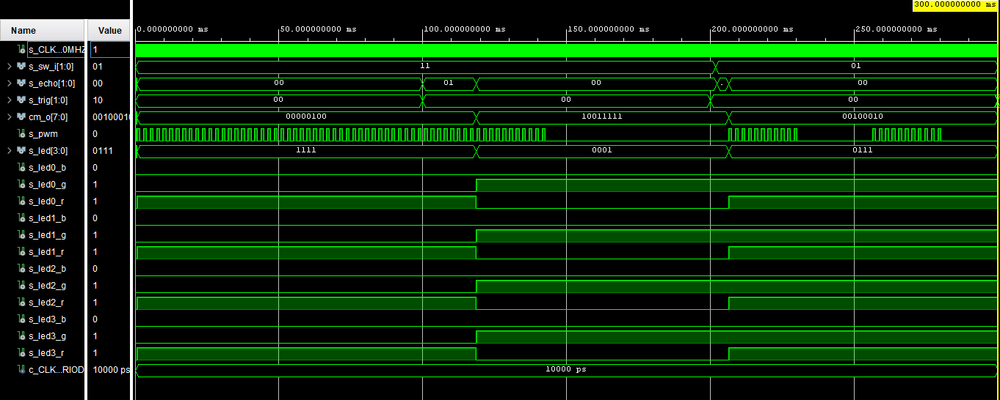
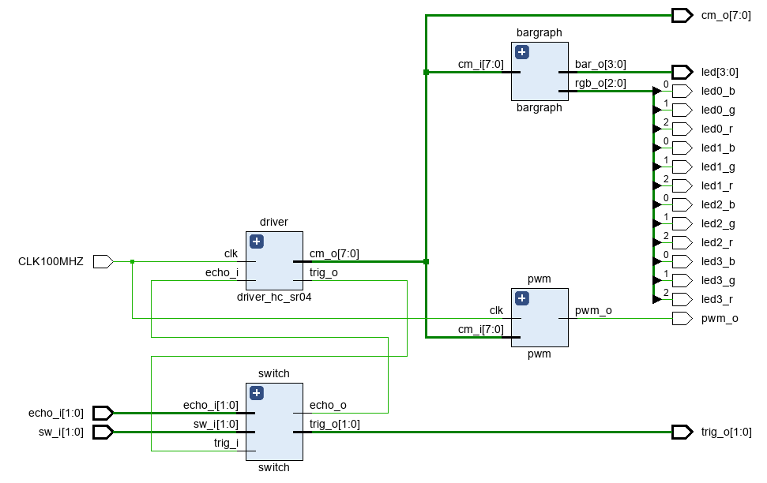

# DE1-Projekt 1: Parking assistant with HC-SR04 ultrasonic sensor, sound signaling using PWM, signaling by LED bargraph.

## Team members

**Pavlo Shelemba** **-** **212579**

**Radim Pařízek** **-** **221483**

**Viliam Putz** **-** **221489**

**Pospíšil Martin - 221454**

## Project objectives

Project goal is to implement parking assistant with HC-SR04 ultrasonic sensor onto board Arty A7-35T.

## Hardware description

### **Board Arty A7 - 35T**

### **HC-SR04 ultrasonic sensors**

The input to the system is an array of three low cost HC-SR04 ultrasonic sensors. Each sensorhas 4 pins, namely Vcc, Trigger, Echo and Ground. When a trigger signal of 10uS is sent tothe ultrasonic sensor the sensor itself produces a set of eight burst signals through thetransmitter. The receiver receives the reflected back signal and output a pulse proportional tothe distance measured. A detailed image is shown in figure 3. The ultrasonic range sensorshave a detection range of 4m with an accuracy of 3mm. The best of the ultrasonic range sensorscould be gained through a FPGA chip. A large amount of sensor readings could be gainedconcurrently without any delay with use of an FPGA.

The ultrasonic sensor works at 5V and the FPGA board works at 3.3V. A trigger signal of 3.3V is enough for the ultrasonic sensor while the echo signal output of 5V could damage the FPGAboard. So a voltage divider is used to level shift the echo signal.

**Pins to board**

|  HC-SR04  | BOARD - JA_Pmod |
| :-------: | :-------------: |
| echo_i[0] |     PIN A11     |
| trig_o[0] |     PIN D12     |
| echo_i[1] |     PIN A18     |
| trig_o[1] |     PIN K16     |

##### Schematics

**Timing Diagram for HC -SR04 Ultrasonic Sensor**

**Block diagram for Ultrasonic VHDL entity**

### Bargraph
**RGB LEDs** 

| Board PIN |  LED   |
| :-------: | :----: |
|    E1     | led0_b |
|    F6     | led0_g |
|    G6     | eld0_r |
|    G4     | eld1_b |
|    J4     | led1_g |
|    G3     | led1_r |
|    H4     | led2_b |
|    J2     | led2_g |
|    J3     | led2_r |
|    K2     | led3_b |
|    H6     | led3g  |
|    K1     | led3_r |

**LEDs**

| Board PIN |  LED   |
| :-------: | :----: |
|    H5     | led[0] |
|    J5     | led[1] |
|    T9     | led[2] |
|    T10    | led[3] |

**Switches**

| Board PIN | Switch  |
| :-------: | :-----: |
|    A8     | sw_i[0] |
|    C11    | sw_i[1] |

### **VHDL modules descriptions** and simulations

[VHDL code of cnt_up_down](https://github.com/xpospi0g/Digital-electronics-1/blob/main/Project/PROJECT/PROJECT.srcs/sources_1/imports/new/cnt_up_down.vhd)

[VHDL code of bargraph](https://github.com/xshele01/Digital-electronics-1/blob/main/Project/PROJECT/PROJECT.srcs/sources_1/new/driver_hc_sr04.vhd)

[VHDL code of driver_hc_sr_04](https://github.com/xshele01/Digital-electronics-1/blob/main/Project/PROJECT/PROJECT.srcs/sources_1/new/driver_hc_sr04.vhd)

[VHDL code of pwm](https://github.com/xshele01/Digital-electronics-1/blob/main/Project/PROJECT/PROJECT.srcs/sources_1/new/pwm.vhd)

[VHDL code of switch](https://github.com/xshele01/Digital-electronics-1/blob/main/Project/PROJECT/PROJECT.srcs/sources_1/new/switch.vhd)

[VHDL code of trigger](https://github.com/xshele01/Digital-electronics-1/blob/main/Project/PROJECT/PROJECT.srcs/sources_1/new/trigger.vhd)

## Description of TOP module and simulation

Top modul is used to implement all modules onto development board Arty A7-35T. It includes three imputs (CLK100MHZ, sw_i[1:0] and echo_i[1:0]), sw_i[0] is for power on and off, sw[1] is used to choose the sensor. Four outputs (cm_o[7:0], pwm_o, trig_o[1:0], led[3:0] and rgb_o[2:0]). 

*[*20:43*]*

echo a trig [0] je pro směr zepředu, [1] pro směr zezadu

[VHDL code of top](https://github.com/xshele01/Digital-electronics-1/blob/main/Project/PROJECT/PROJECT.srcs/sources_1/new/top.vhd)

**Simulation**

**Top module**

### **Video**

#### References

diskuze - vzdalenost se spocita za predpokladu zvuku 330, meni se s teplotou a navrch pridame teplotni senzor aby dynamicky prepocitaval 

pouzivame jen dva senzory nejsou presne a ve skutecnych se pouziva 4-8 senzoru, zvetsi pocet senzoru 