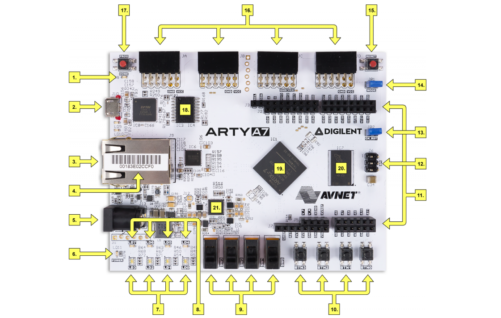
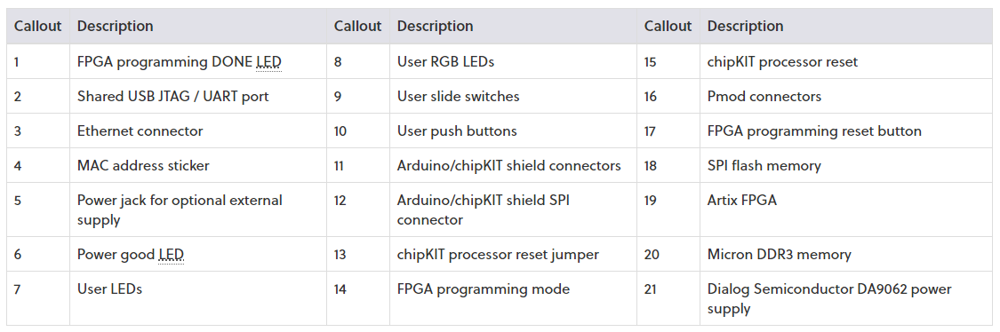
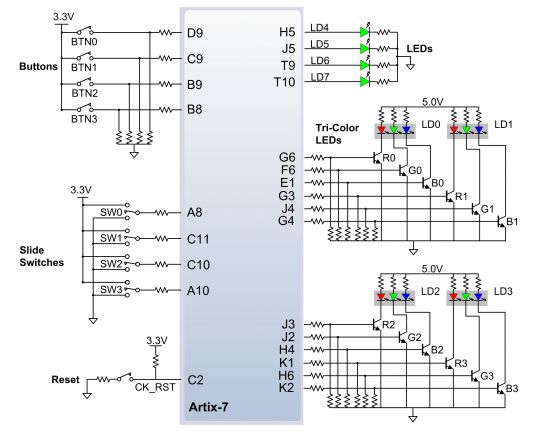
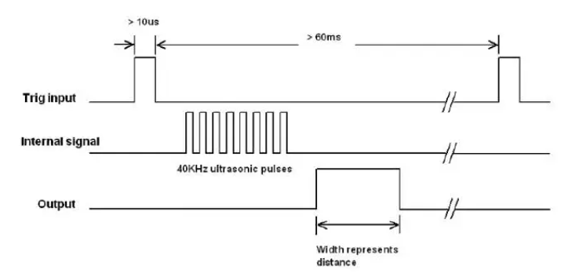
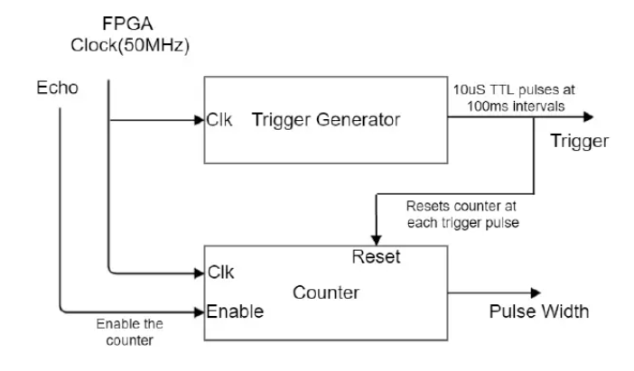

# DE1-Projekt 1: Parking assistant with HC-SR04 ultrasonic sensor, sound signaling using PWM, signaling by LED bargraph.


### Team members

Pavlo Shelemba 

Radim Pařízek 

Viliam Putz  

Pospíšil Martin 221454


### Project objectives

Project goal is to implement parking assistant with HC-SR04 ultrasonic sensor onto board Arty A7-35T.

It should have 4- digit sevensegment display to show 4-digit PIN and relay to unlock the door.

As additional features, we decided to add small siren to produce sound when pin is incorrect and a dual color LED to light green when pin is correct or light red when pin is incorrect.


### Hardware description

###### Board Arty A7 - 35T







###### HC-SR04 ultrasonic sensors

The input to the system is an array of three low cost HC-SR04 ultrasonic sensors. Each sensorhas 4 pins, namely Vcc, Trigger, Echo and Ground. When a trigger signal of 10uS is sent tothe ultrasonic sensor the sensor itself produces a set of eight burst signals through thetransmitter. The receiver receives the reflected back signal and output a pulse proportional tothe distance measured. A detailed image is shown in figure 3. The ultrasonic range sensorshave a detection range of 4m with an accuracy of 3mm. The best of the ultrasonic range sensorscould be gained through a FPGA chip. A large amount of sensor readings could be gainedconcurrently without any delay with use of an FPGA.

The ultrasonic sensor works at 5V and the FPGA board works at 3.3V. A trigger signal of 3.3Vis enough for the ultrasonic sensor while the echo signal output of 5V could damage the FPGAboard. So a voltage divider is used to level shift the echo signal.


##### Schematics

######  Timing Diagram for HC -SR04 Ultrasonic Sensor




###### Block diagram for Ultrasonic VHDL entity



### **VHDL modules descriptions**

[Odkaz na vhdl kód modulu driver_7seg_4digits]( )

[Odkaz na vhdl kód modulu driver_7seg_4digits]( )

[Odkaz na vhdl kód modulu driver_7seg_4digits]( )

[Odkaz na vhdl kód modulu driver_7seg_4digits]( )


#### TOP module and simulation


```vhdl

```


###### Simulace top modulu 

#### Diskuze

diskuze - vzdalenost se spocita za predpokladu zvuku 330, meni se s teplotou a navrch pridame teplotni senzor aby dynamicky prepocitaval 

pouzivame jen dva senzory nejsou presne a ve skutecnych se pouziva 4-8 senzoru, zvetsi pocet senzoru 